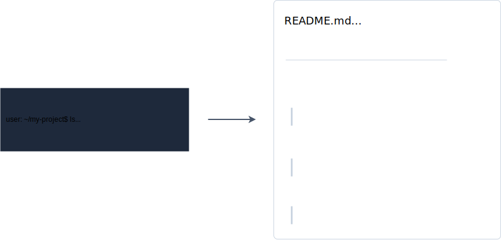

# Folder Organization

Folder Organization is a powerful Rust tool designed to generate and maintain README.md files within your project directories.

Look at the [CLI page for further information](https://github.com/folder-organization/folder-organization).
